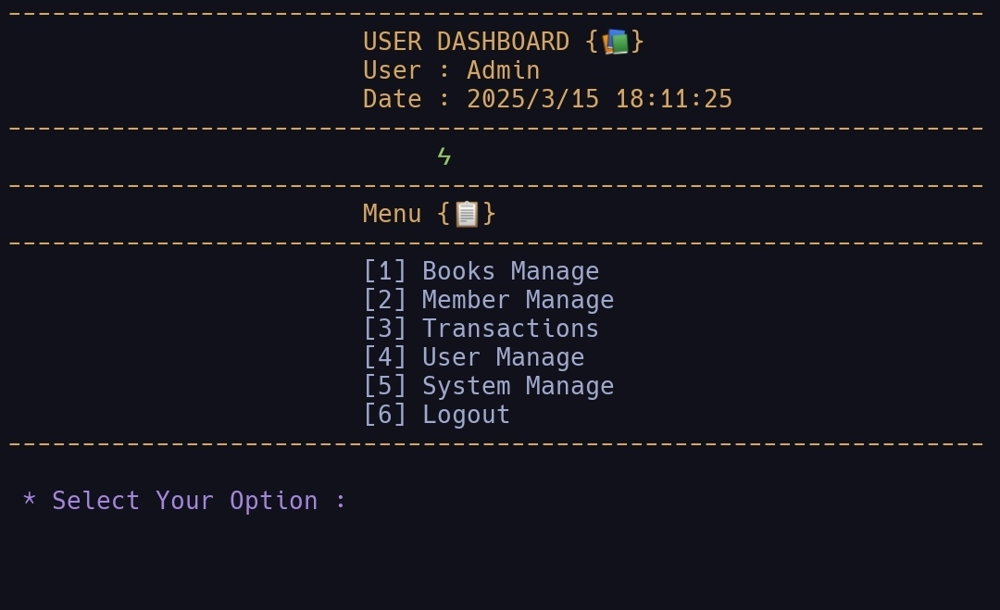
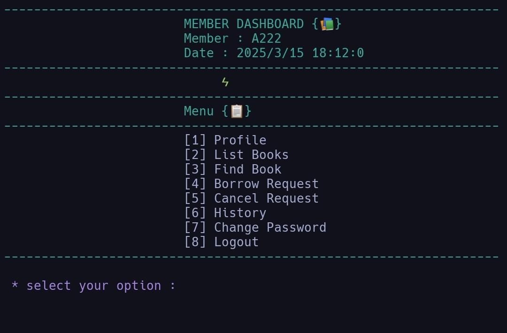

### [User Interface]

### [Member Interface]


# Library Management System - Command Line Program

Welcome to my Library Management System—my first serious dive into C++ system programming!
This project is a command-line based application designed to manage library operations such as book management, member management, transactions, and user management. It is built using C++ and utilizes a Makefile for compilation and execution.
Below, I’ll walk you through the journey of building this system, explore the code, and maybe even contribute I’d love that!

## Project Overview
This is a command-line Library Management System built from scratch in C++. It’s designed to manage a library’s operations, 
It allows librarians and members to perform various tasks such as adding, updating, deleting, and searching for books and members. It also handles transactions like borrowing and returning books, tracking requests, and generating statistics. The system is modular, I broke it into modules (Core, Lib, Screens) to keep things sane as it grew, making it easy to maintain and extend.
It’s not just a toy project—it’s my proof that I can tackle C++ and make something useful.

### Features
 1. **Book Management**: 
   - Add, update, delete, and find books.
   - List all books or filter by availability.
   - Reset book data.
 2. **Member Management**:
   - Add, update, delete, and find members.
   - List all members or filter by type (students/teachers).
   - Reset member data.
 3. **User Management**:
   - Add, update, delete, and find users.
   - List all users and view login records.
 4. **Transactions**: 
   - Borrow and return books.
   - Manage requests.
   - Tracks Member activities
   - View history (pending, borrowed, returned, canceled).
 5. **System Management**: 
   - View system statistics.
   - Update system.
   - Change user (admin, librarians) passwords.
 6. **Member Dashboard**: 
   - Members can borrow books, cancel requests, and view their profile.
   - change member passwords
 7. **User Dashboard**: 
   - Users (librarians) can manage books, members, and transactions based on thier permissions.
 8. **Register/Login**:
   - Members can create an account by providing necessary details such as name, email, and password.
   - Registered Members can login to the system using their credentials.
 9. **Security**:
   - Protect users and members data (e.g., passwords) with encryption.
   - Prevent unauthorized access to admin features.


### Rules and Constraints
I wanted this system to feel like a real library, so I added some rules:
- **Request and Borrowing Limits**: Members have caps based on their role—students can borrow up to 2 books, teachers up to 3, and request limits match these. No overloading the system!
- **Pickup Deadline Rule**: Members must pick up requested books within a time limit (e.g., 24h). If they don’t, the request is auto-canceled, and their violation counter increases.
- **No Duplicates**: You can’t borrow the same book twice until it’s returned and available again—keeps things fair.
- **Violation Tracking**: Return a book past its due date, and your violation counter ticks up. Hit 15 violations, and you’re blocked from system until an admin steps in.
- **Why This Matters**: Coding these rules taught me loops, conditions, and how to juggle member data—tricky but rewarding!

## Development Journey
**Implementation**: 
   - The project was implemented in C++ to leverage its object-oriented capabilities.
   - Classes were designed to represent entities like Book, Member, Transaction, and User.
   - Utility classes were created for input validation, date handling, and string manipulation.
**Challenges**:
   - Managing a large codebase was challenging, but the modular structure helped.
   - Input validation and error handling required careful attention to ensure robustness.
   - Testing each feature manually was time-consuming but necessary.
**Learning Outcomes**:
   - Gained a deeper understanding of object-oriented programming (OOP) principles.
   - Learned to manage a large project with multiple files and dependencies.
   - Improved skills in debugging and testing.

## How to Run the program
Ready to try it? The Makefile makes it simple.
First of all you need to know that this program is designed to run in a Linux environment. It uses Linux-specific commands such as:
   - system("clear") – to clear the terminal screen.
If you are using Windows, you may need to replace system("clear") with system("cls") or use alternative cross-platform methods.
### Prerequisites 
   - C++ compiler (`g++` recommended—I used GCC).
   - `make` utility (usually comes with Linux/Mac; get it via MinGW or MSYS2 on Windows).
   - Git to clone the repo.
### Installation
1. Clone the repo:
    ```bash
    git clone https://github.com/OxRachid/LibraryManagementSystem.github
    ```
2. Navigate to the folder:
    ```bash
    cd LibraryManagementSystem
    ```
3. Build the project:
   ```bash
   make
   ```
   (This compiles all .cpp files, links them into Output_Dir/MyProgramRun, and copies .txt data files.)
4.  Run it:
   ```bash
   ./Output_Dir/MyProgramRun  # Linux/Mac
   Output_Dir\MyProgramRun.exe  # Windows
   ```
   Or use **make Run** to run in one go!

- Clean Up: 
   To remove built files
   ```bash
   make clear
   ```
## Acknowledgments
  - Dr. Mohammed Abu-Hahdoud's courses for teaching me C++.
  - You, for checking out my first system!

## Contact
  Got feedback or C++ advice? Hit me up via GitHub issues or discussions. Let’s learn together!
